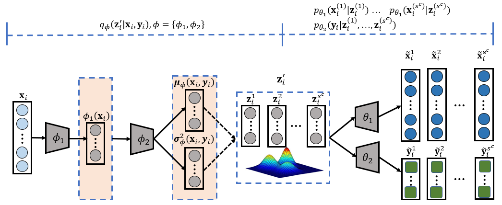

# Deep Generative Mixture Model for Robust Imbalance Classification

> Deep Generative Mixture Model for Robust Imbalance Classification
>
> Xinyue Wang, Yilin Lyu, Liping Jing, Tieyong Zeng

This is the official implementation of *DGC* and *DGCMM*.

## Abstract
Discovering hidden pattern from imbalanced data is a critical issue in various real-world
applications. The existing classification methods usually suffer from the limitation 
of data especially the minority classes, and result in unstable prediction and low
performance. In this paper, a deep generative classifier is proposed to mitigate this 
issue via both data perturbation and model perturbation. Specially, the proposed 
generative classifier is  derived from a deep latent variable model where the latent 
variable is represented by a probability distribution to enforce the uncertainty of 
model and lead to stable predictions.  Furthermore, the data generative procedure is 
modeled with a Gaussian Mixture Model, which  aims to capture discriminative latent 
distribution and implement data perturbation. Extensive experiments have been conducted
on widely-used real imbalanced image datasets. By comparing with the popular imbalanced 
classification baselines, experimental results demonstrate the superiority of our 
proposed model on imbalance classification task.


## Requirement
The code was tested on:
- python=3.7
- tensorflow=1.14.0
- torchvision=0.4.1 (utilizd for dataset preparation)


## Usage
```
usage: python run.py [-h] [--exp EXP]

optional arguments:
  -h, --help   show this help message and exit
  --exp EXP    dataset [mnist/fashion/celeba/svnh]
```
The dataset will be automatically downloaded and prepared in `./data` when first run.
